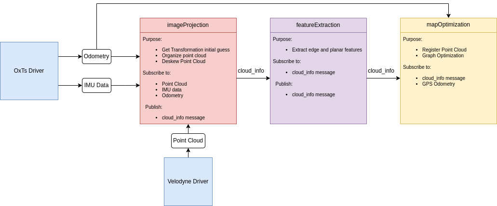

# LIO-SAM

**A real-time lidar-inertial odometry package. We strongly recommend the users read this document thoroughly. A video of the demonstration of the method can be found on [YouTube](https://www.youtube.com/watch?v=A0H8CoORZJU).**

<p align='center'>
    
</p>

<p align='center'>
    
    
    
    
</p>

## Menu

  - [**System architecture**](#system-architecture)

  - [**Package dependency**](#Dependencies)

  - [**Package install**](#install)

  - [**Prepare lidar data**](#prepare-lidar-data) (must read)

  - [**Prepare IMU data**](#prepare-imu-data) (must read)

  - [**Run the package**](#run-the-package)

  - [**Other notes**](#other-notes)

  - [**Issues**](#issues)

  - [**Paper**](#paper)

  - [**Related Package**](#related-package)

  - [**Acknowledgement**](#acknowledgement)

## System architecture

<p align='center'>
    
</p>

## Dependencies

Tested with ROS2 version humble on Ubuntu 22.04
- [ROS2](https://docs.ros.org/en/humble/Installation.html)
  ```
  sudo apt install ros-<ros2-version>-perception-pcl \
		   ros-<ros2-version>-pcl-msgs \
		   ros-<ros2-version>-vision-opencv \
		   ros-<ros2-version>-xacro
  ```
- [gtsam](https://gtsam.org/get_started) (Georgia Tech Smoothing and Mapping library)
  ```
  # Add GTSAM-PPA
  sudo add-apt-repository ppa:borglab/gtsam-release-4.1
  sudo apt install libgtsam-dev libgtsam-unstable-dev
  ```

## Install

Use the following commands to download and compile the package.

  ```
  cd ~/ros2_ws/src
  git clone https://github.com/RI-SE/LIO-SAM.git
  cd lio-sam
  git checkout ros2
  cd ..
  colcon build
  ```

## Prepare lidar data

The user needs to prepare the point cloud data in the correct format for cloud deskewing, which is mainly done in "imageProjection.cpp". The two requirements are:
  - **Provide point time stamp**. LIO-SAM uses IMU data to perform point cloud deskew. Thus, the relative point time in a scan needs to be known. The up-to-date Velodyne ROS driver should output this information directly. Here, we assume the point time channel is called "time." The definition of the point type is located at the top of the "imageProjection.cpp." "deskewPoint()" function utilizes this relative time to obtain the transformation of this point relative to the beginning of the scan. When the lidar rotates at 10Hz, the timestamp of a point should vary between 0 and 0.1 seconds. If you are using other lidar sensors, you may need to change the name of this time channel and make sure that it is the relative time in a scan.
  - **Provide point ring number**. LIO-SAM uses this information to organize the point correctly in a matrix. The ring number indicates which channel of the sensor that this point belongs to. The definition of the point type is located at the top of "imageProjection.cpp." The up-to-date Velodyne ROS driver should output this information directly. Again, if you are using other lidar sensors, you may need to rename this information. Note that only mechanical lidars are supported by the package currently.

## Prepare IMU data

  - **IMU requirement**. Like the original LOAM implementation, LIO-SAM only works with a 9-axis IMU, which gives roll, pitch, and yaw estimation. The roll and pitch estimation is mainly used to initialize the system at the correct attitude. The yaw estimation initializes the system at the right heading when using GPS data. 

  - **IMU alignment**. LIO-SAM transforms IMU raw data from the IMU frame to the Lidar frame, which follows the ROS REP-105 convention (x - forward, y - left, z - upward). To make the system function properly, the correct extrinsic transformation needs to be provided in "params.yaml" file. **The reason why there are two extrinsics is that my IMU (Microstrain 3DM-GX5-25) acceleration and attitude have different coordinates. Depending on your IMU manufacturer, the two extrinsics for your IMU may or may not be the same**.
    - "extrinsicRot" in "params.yaml" is a rotation matrix that transforms IMU gyro and acceleometer measurements to lidar frame.
    - "extrinsicRPY" in "params.yaml" is a rotation matrix that transforms IMU orientation to lidar frame.

  - **IMU debug**. It's strongly recommended that the user uncomment the debug lines in "imuHandler()" of "imageProjection.cpp" and test the output of the transformed IMU data. The user can rotate the sensor suite to check whether the readings correspond to the sensor's movement. A YouTube video that shows the corrected IMU data can be found [here (link to YouTube)](https://youtu.be/BOUK8LYQhHs).


<p align='center'>
    
</p>
<p align='center'>
    
</p>


## Run the package

1. Run the launch file:
```
ros2 launch lio_sam run.launch.py
```

2. Play existing bag files:
```
ros2 bag play your-bag.bag
```

## Save map

In the cmd folder there are a bash script to save your map to `/home/LIO-SAM_Maps/`

Navigate to /LIO-SAM/cmd and run: `./saveMap.sh`

OR you can do it manually like this:
```
ros2 service call /lio_sam/save_map lio_sam/srv/SaveMap
```
```
ros2 service call /lio_sam/save_map lio_sam/srv/SaveMap "{resolution: 0.2, destination: /Downloads/service_LOAM}"
```

## Other notes

  - **Loop closure:** The loop function here gives an example of proof of concept. It is directly adapted from LeGO-LOAM loop closure. For more advanced loop closure implementation, please refer to [ScanContext](https://github.com/irapkaist/SC-LeGO-LOAM). Set the "loopClosureEnableFlag" in "params.yaml" to "true" to test the loop closure function. In Rviz, uncheck "Map (cloud)" and check "Map (global)". This is because the visualized map - "Map (cloud)" - is simply a stack of point clouds in Rviz. Their postion will not be updated after pose correction. The loop closure function here is simply adapted from LeGO-LOAM, which is an ICP-based method. Because ICP runs pretty slow, it is suggested that the playback speed is set to be "-r 1" or less.

<p align='center'>
    
    
</p>

  - **Using GPS:** To enable the GPS function, set "gpsTopic" in "params.yaml". In Rviz, uncheck "Map (cloud)" and check "Map (global)". Also check "Odom GPS", which visualizes the GPS odometry. "gpsCovThreshold" can be adjusted to filter bad GPS readings. "poseCovThreshold" can be used to adjust the frequency of adding GPS factor to the graph. For example, you will notice the trajectory is constantly corrected by GPS whey you set "poseCovThreshold" to 1.0. Because of the heavy iSAM optimization, it's recommended that the playback speed is "-r 1" or less.

<p align='center'>
    
</p>


## Issues

  - **Zigzag or jerking behavior**: if your lidar and IMU data formats are consistent with the requirement of LIO-SAM, this problem is likely caused by un-synced timestamp of lidar and IMU data.

  - **Jumpping up and down**: if you start testing your bag file and the base_link starts to jump up and down immediately, it is likely your IMU extrinsics are wrong. For example, the gravity acceleration has negative value.

  - **mapOptimization crash**: it is usually caused by GTSAM. Please install the GTSAM specified in the README.md. More similar issues can be found [here](https://github.com/TixiaoShan/LIO-SAM/issues).

  - **gps odometry unavailable**: it is generally caused due to unavailable transform between message frame_ids and robot frame_id (for example: transform should be available from "imu_frame_id" and "gps_frame_id" to "base_link" frame. Please read the Robot Localization documentation found [here](http://docs.ros.org/en/melodic/api/robot_localization/html/preparing_sensor_data.html).

## Paper

Thank you for citing [LIO-SAM (IROS-2020)](./config/doc/paper.pdf) if you use any of this code.
```
@inproceedings{liosam2020shan,
  title={LIO-SAM: Tightly-coupled Lidar Inertial Odometry via Smoothing and Mapping},
  author={Shan, Tixiao and Englot, Brendan and Meyers, Drew and Wang, Wei and Ratti, Carlo and Rus Daniela},
  booktitle={IEEE/RSJ International Conference on Intelligent Robots and Systems (IROS)},
  pages={5135-5142},
  year={2020},
  organization={IEEE}
}
```

Part of the code is adapted from [LeGO-LOAM](https://github.com/RobustFieldAutonomyLab/LeGO-LOAM).
```
@inproceedings{legoloam2018shan,
  title={LeGO-LOAM: Lightweight and Ground-Optimized Lidar Odometry and Mapping on Variable Terrain},
  author={Shan, Tixiao and Englot, Brendan},
  booktitle={IEEE/RSJ International Conference on Intelligent Robots and Systems (IROS)},
  pages={4758-4765},
  year={2018},
  organization={IEEE}
}
```

## Related Package

  - [Lidar-IMU calibration](https://github.com/chennuo0125-HIT/lidar_imu_calib)
  - [LIO-SAM with Scan Context](https://github.com/gisbi-kim/SC-LIO-SAM)

## Acknowledgement

  - LIO-SAM is based on LOAM (J. Zhang and S. Singh. LOAM: Lidar Odometry and Mapping in Real-time).
